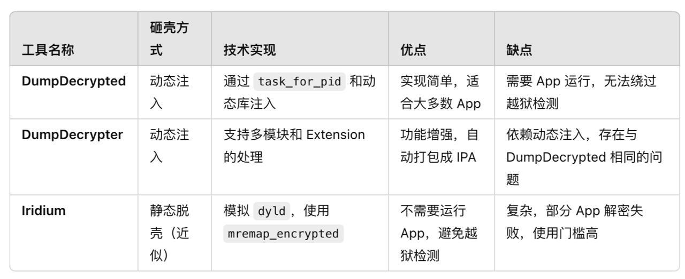

# Iridium

使用 fouldecrypt 完全静态。支持 iOS 13.5 <-> 14.4.1

DumpDecrypter 脱壳工具——> 是~ 基于“DumpDecrypted”的修改封装编译.

DumpDecrypted、DumpDecrypter 与 Iridium 的对比

关于~    DumpDecrypted

一、实现原理：dumpdecrypted 是 iOS 砸壳工具的经典代表，它通过动态库注入，利用系统加载可执行文件时解密的特性，将解密后的二进制从内存中导出。其工作机制是当 iOS 系统加载一个加密的 Mach-O 文件时，在内存中解密其代码页，dumpdecrypted 通过解析 LC_ENCRYPTION_INFO 找到对应内存地址，将解密后的代码写回原文件的副本，并移除加密标识（cryptid）。

二、缺点：该方法简单有效，适用于大多数场景，但需要将 dumpdecrypted.dylib 注入到目标进程中，这可能在某些 App 含有越狱检测机制时遇到困难。此外，该工具仅适用于 iOS 上的进程，并且不支持静态脱壳。

1、App 含有越狱检测机制，直接退出。

2、某些 Framework 未在 App 启动时加载，导致砸壳不完整。

关于、 DumpDecrypter   即 狗哥哪个

一、实现原理：DumpDecrypter 是类似于 DumpDecrypted 的工具，但它在功能上做了扩展和优化。其主要改进包括针对不同的框架和 App Extension 的处理方式。与 DumpDecrypted 相比，它能够更好地支持 App 包含的多个模块（例如独立运行的 Extension 进程），并可以处理多次加载的框架。

二、缺点：DumpDecrypter 的使用体验有所提升，能够根据应用的 Bundle ID 直接定位程序路径并自动打包成 IPA 文件，但仍然依赖动态注入的方式进行操作，无法完全避免越狱检测等问题。此外，与 DumpDecrypted 一样，它主要适用于动态脱壳，不支持完全静态脱壳。

关于     Iridium  接近静态脱壳 的工具

一、实现原理：Iridium 是一种更接近静态脱壳的工具。它通过模拟 dyld 的行为，将加密的 Mach-O 文件映射到内存，并利用系统内核完成加密页的解密操作，而不需要执行整个 App。这与传统的砸壳工具通过动态加载后再导出的方式有本质不同。Iridium 尝试调用 mremap_encrypted 解密内存页，这是 iOS 系统中的一个内核函数，用于处理 FairPlay DRM 的加密解密过程。

二、   缺点：由于 Iridium 不需要运行目标 App，因此它能够避免很多由于 App 含有越狱检测、框架加载不完全等问题的干扰，理论上可以提高兼容性和可靠性。然而，其使用较为复杂，并且由于对内核的直接操作，某些情况下会遇到与内存对齐相关的问题，导致解密失败。

由于 dyld 在 iOS 14 后不再用户态调用该函数，解密过程变得更加复杂。FlexDecrypt 通过映射 Mach-O 文件并在访问时触发解密操作，但偶尔会因内存对齐问题导致失败。
